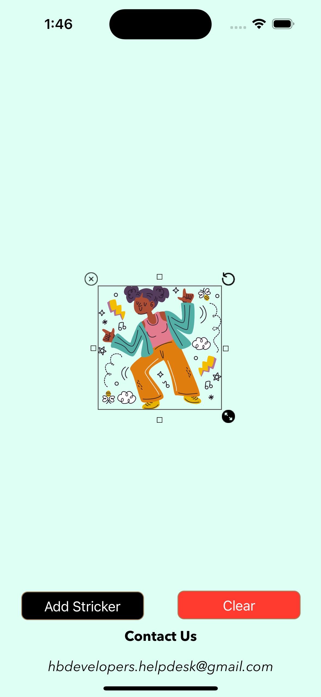
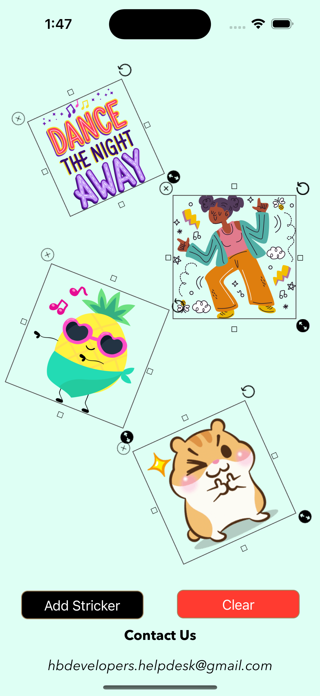
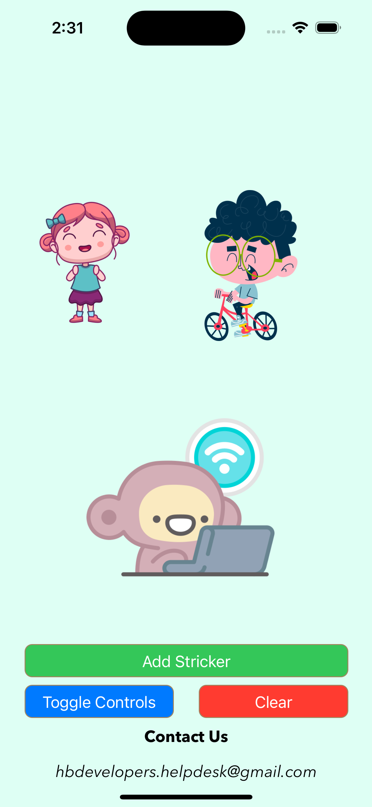

# HBStickerViewOrResizableView
Use HBStickerView for photo editing and sticker decorations in applications of ios swift

# You can watch a demo video [here](https://youtube.com/shorts/Y1SlVdGY50c)

# Project preview

<p float="left">
  
   
  
</p>

# How to Use

## First case
Step 1: Take a view in your storyboard

Step 2: Set Custom class of view to HBStickerView

Step 3: Build and Run.

## Second case

```swift
  let stickerview = HBStickerView(frame: CGRect(x: 0, y: 0, width: 200, height: 200))
  
  stickerview.stickIcon = UIImage(named: "main")
  
  self.view.addSubview(stickerview)
```  
    
## Controls
  Call to showControls() function for show controls like cross, rotate and resize.
  
  **stickerview.showControls()**
  
  Call to hideControls() function for hide controls like cross, rotate and resize.
  
  **stickerview.hideControls()**
  
  ### Check controls state with
  ```swift
            let stickerview = HBStickerView(frame: CGRect(x: 0, y: 0, width: 200, height: 200))
        stickerview.isControlsHidden
```
    
## How to remove
```swift
    private func removeAllStickers(){
        self.view.subviews.forEach { view in
            if view is HBStickerView{
                view.removeFromSuperview()
            }
        }
    }
```

## If you appreciate my work, consider [buying me](https://www.paypal.com/paypalme/hbdev/5usd) a cup of ☕️ to keep me recharged 🤘🏼 
[[PayPal](https://www.paypal.com/paypalme/hbdev/5usd)]

