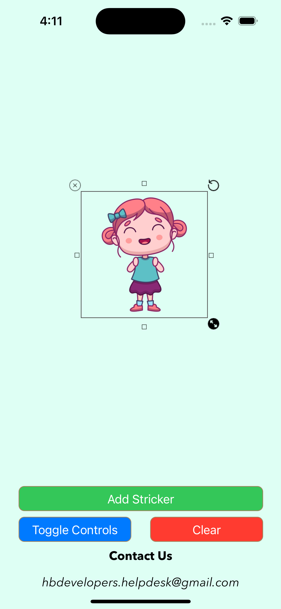
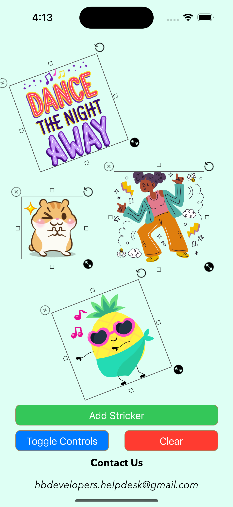

# HBStickerViewOrResizableView
Use HBStickerView for photo editing and sticker decorations in applications of ios swift

# How to Use

## First case
Step 1: Take a view in your storyboard

Step 2: Set Custom class of view to HBStickerView

Step 3: Build and Run.

## Second case

```swift
  let stickerview = HBStickerView(frame: CGRect(x: 0, y: 0, width: 200, height: 200))
  
  stickerview.stickIcon = UIImage(named: "main")
  
  self.view.addSubview(stickerview)
```  
    
## Controls
  Call to showControls() function for show controls like cross, rotate and resize.
  
  **stickerview.showControls()**
  
  Call to hideControls() function for hide controls like cross, rotate and resize.
  
  **stickerview.hideControls()**
  
  ### Check controls state with
    stickerview.isControlsHidden
    ```swift
    if(stickerview.isControlsHidden){
    //do something here
    }
    ```
    
## How to remove
```swift
    private func removeAllStickers(){
        self.view.subviews.forEach { view in
            if view is HBStickerView{
                view.removeFromSuperview()
            }
        }
    }
```
# Project preview

<p float="left">
  
   
  
</p>
